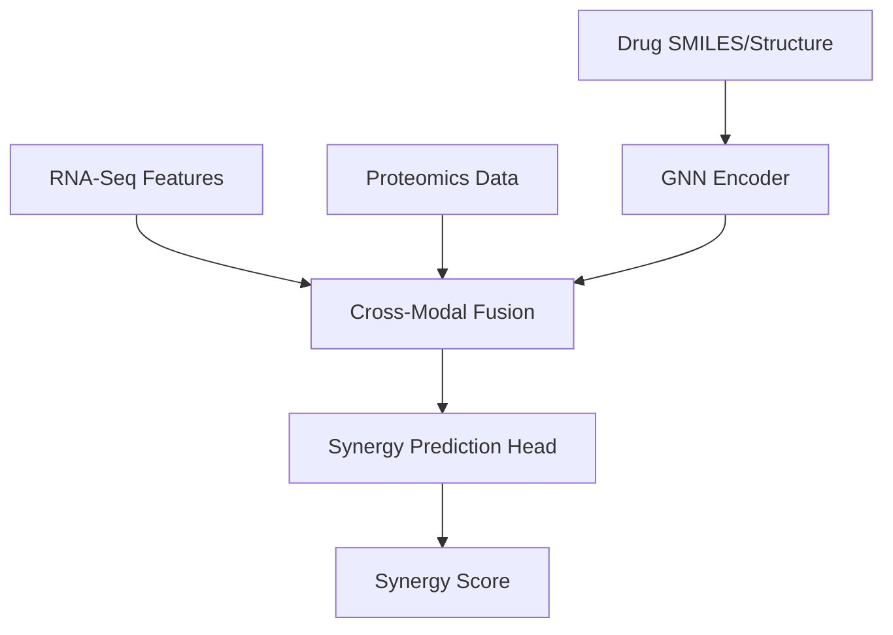

# 🧬 MOOMIN: Multi-Omics Discovery Network

[](https://www.python.org/downloads/)
[](https://pytorch.org/)
[](https://pytorch-geometric.readthedocs.io/)

**MOOMIN (Multi-Omics Molecular Intelligence Network)** is a Deep Learning framework designed for the integration of diverse omics data types (transcriptomics, proteomics, genomics) to predict the synergy of anti-cancer drug combinations.

Inspired by state-of-the-art research in computational oncology, this project utilizes **Graph Neural Networks (GNNs)** to model molecular interactions and **Cross-Modal Attention** to fuse multi-omics features for personalized therapeutic recommendations.

## 🌟 Key Features

- **Multi-Modal Fusion:** Seamlessly integrates gene expression, protein-protein interactions (PPI), and chemical structure embeddings.
- **GNN-Based Molecular Modeling:** Captures local and global structural information of drug molecules using Message Passing Neural Networks (MPNN).
- **Synergy Prediction:** Predicts the combined effect of two or more drugs on specific cancer cell lines.
- **Explainable Omics:** Identifies which omics features contributed most to the predicted synergy.

## 🏗️ Architecture



## 🛠️ Installation

```bash
git clone https://github.com/gavedwards0/MOOMIN-MultiOmics-Discovery.git
cd MOOMIN-MultiOmics-Discovery
pip install -r requirements.txt
```

## 🔬 Example: Predicting Combination Synergy

```python
from src.model import MOOMINModel
from src.data import OmicsDataset

# Load sample omics and drug data
dataset = OmicsDataset(cell_line="MCF7")
model = MOOMINModel(input_dim=512)

# Predict synergy for a drug pair
drug_pair = ("Doxorubicin", "Paclitaxel")
score = model.predict_synergy(dataset, drug_pair)

print(f"Predicted Synergy Score: {score:.4f}")
```

## 🤝 Contributing
Contributions to GNN architectures and bioinformatics pipelines are welcome!

## 👤 Author
**Gavin Edwards**  
Principal AI Engineer @i.AI | Ex-AstraZeneca
